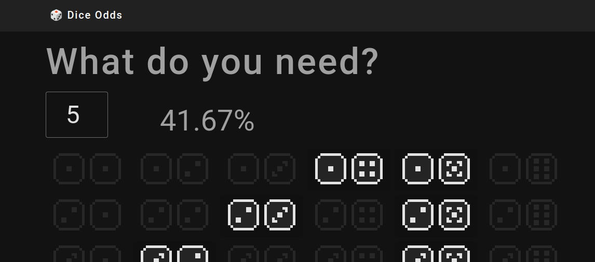

# 🎲 Dice Odds Calculator

Do you play, for example, parchís and have to make a difficult decision where to stand? **This page helps you to understand which dice will make you win or lose**.

This application calculates and shows you your odds of getting the number you are looking for with one or the sum of your dice.

---

## Table of Contents

- [🤔 Motivation](#motivation)
- [🧮 Mathematical Explanation](#mathematical-explanation)
- [📋 Possible Improvements](#possible-improvements)
- [💞 Contributing](#contributing)
- [📜 License](#license)

## 🤔 Motivation

Sometimes mathematics deals with concepts that can be somewhat complex and abstract for many people. However, many of these concepts can be easily understood by visualising them.

While playing with a friend we discussed certain moves where we should move the pieces so that the odds would play in our favour. As he couldn't understand the explanation I decided to do this "one afternoon" project.

## 🧮 Simple mathematical explanation

> Note: there are many types of dice problems. This repo right now is based on the dynamics of parchís, where you can use the value of one or both dice.

In reality, when rolling two dice with the order not mattering, it becomes relatively simple to estimate which numbers are more likely to appear. A standard 6-sided die gives you a 16.6% chance of landing on any number from 1 to 6. However, when you aim for a specific number, the dynamics change.

For instance, if you're trying to roll a 1 with two dice, the odds improve because one die's 'bad luck' can be compensated by the 'good luck' of the other. As you aim for higher numbers, the number of combinations that can either individually or when added together produce that number increases.

This trend continues up to 6, where things take a dramatic turn. Beyond this point, a single die can no longer achieve the desired result, and you must rely on both dice cooperating. Consequently, the probabilities drop sharply and continue to decrease as the number you're aiming for increases.

At the extreme end, when you're trying to get a sum of 12, out of the 36 possible combinations with 2 dice, only 1 of them will yield the desired outcome.

Is the explanation not clear to you? **Run to the app to see it!**

(Pending improve).

## 📋 Possible improvements

- [ ] Improve responsive design.
- [ ] Allow to set the number of dice.
- [ ] Allow to tie the dice, to take into account only the sum and not each one individually.
- [ ] Add calculator for more games (Poker? Board games?.

And more. (open your issue for new ideas!)

## 💞 Contributing

If you want to contribute check the [CONTRIBUTING.md](.github/CONTRIBUTING.md) (pending to create).

Thank you!

## 📜 License
